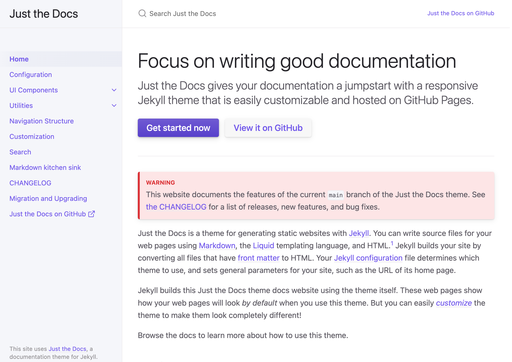

Site criado com o Jekyll e Just the Docs Theme

Tudo foi criado com base nas docs do próprio GitHub e da Just The Docs:

- [GitHub Pages](https://docs.github.com/pt/pages/quickstart)
- [Jekyll](https://jekyllrb.com/docs/)
- [Just the Docs Theme](https://just-the-docs.github.io/just-the-docs/)

Todo o projeto está sob a licença MIT e pode ser usado como base para outros projetos, além de estar aberto a PRs e melhorias, sintam-se à vontade para contribuir, questionar e corrigir!

