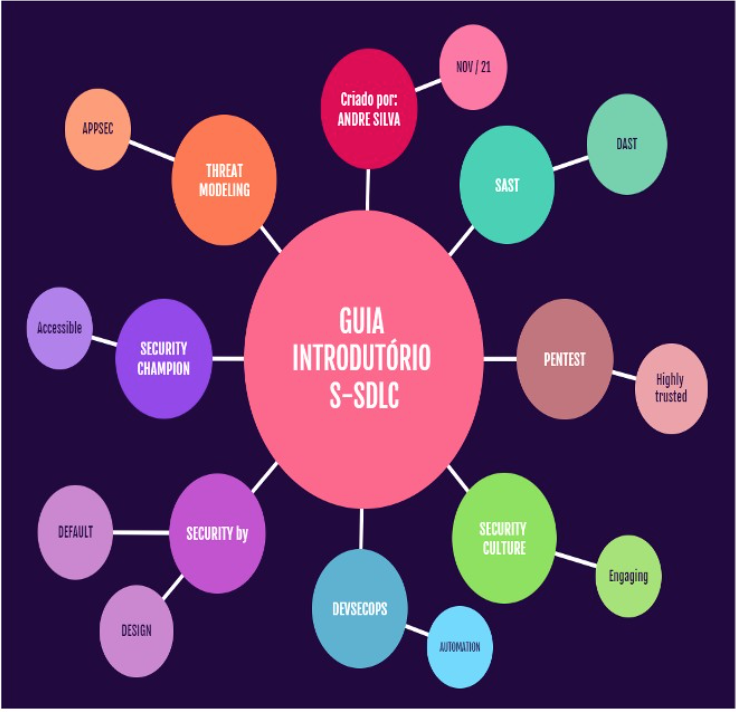

Guia Introdutório a S-SDLC (Esteira de Desenvolvimento Seguro)
{: .text-center .fw-700 .fs-09 }

Este guia fo criado por mim, com o intuito de compartilhar o conhecimento adquirido durante meus estudos e aplicações práticas em ambientes produtivos.

Índice
{: .fw-700 }

Introdução
{: .fw-700 }

Fase de Educação / Conscientização:
{: .fw-700 }

    1 - Treinamento de código

Fases de Tecnologias e Processos:
{: .fw-700 }

	2 - Levantamento de Requisitos
		2.1 - Entender o produto proposto
		2.2 - Definição de aceites de qualidade em Segurança
		2.3 - Elencar possíveis implicações de técnicas e de governança

	3 - Design
		3.1 - Modelagem de Ameaças
		3.2 - Analisar as superfícies de ataque e endpoints disponíveis

	4 - Implementação
		4.1 - Definir ferramentas
		4.2 - Software Composition Analysis (SCA)
		4.3 - Análise estática de código (SAST)
		4.4 - Análise dinâmica de código (DAST)

	5 - Executando Pentest
		5.1 - Validar se as ameaças identificadas foram evitadas
		5.2 - Pentest

Fase de Melhoria Contínua (Accountability):
{: .fw-700 }

	6 - Resposta à Incidentes

	7 - Considerações Gerais
		7.1 - Ganhos no uso de uma SSDL
		7.2 - Possíveis entraves e dificuldades

Dicionário de Termos
{: .fw-700 }

Referências
{: .fw-700 }

===

Última revisão:
{: .fw-700 }
29/04/2023
