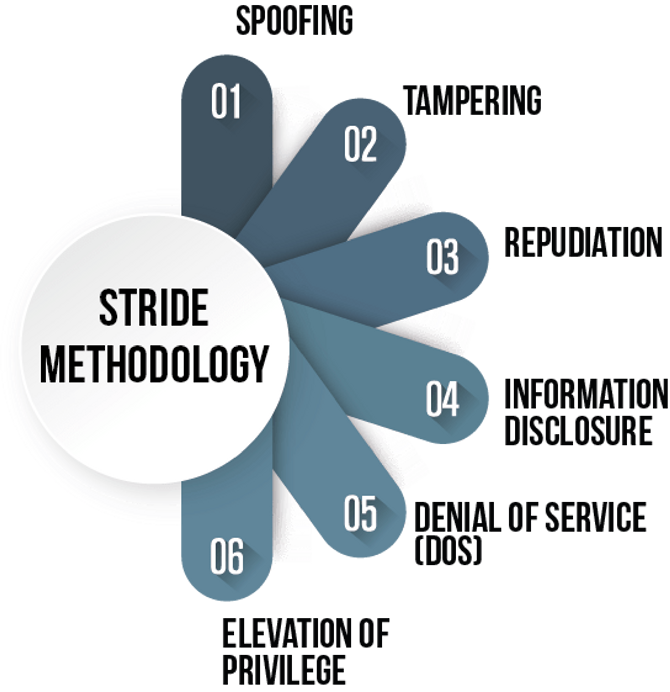

Após o levantamento de requisitos funcionais e não funcionais, teremos as arquiteturas propostas, topologias idealizadas e os fluxos sumariamente desenhados, desencadeando uma das principais fases e atividades da Esteira de Desenvolvimento Seguro, que é a criação da Modelagem de Ameaças (Threat Modeling), "uma análise das representações do sistema destacando as principais preocupações de segurança e privacidade", conforme visto na definição desse elemento em seu manifesto. 

Um ponto que deve ser destacado nessa fase, é que a modelagem pretende iniciar o reconhecimento de itens que podem dar errado na construção do sistema, auxiliando o time de Engenharia, sem se tornar empecilho ou elencar vulnerabilidades, pois, um dos seus valores é a "cultura de buscar e corrigir itens de design sob o olhar de compliance" e principalmente fomentar "a colaboração das pessoas, acima de processos, metodologias e ferramentas". 

Com isso posto, a dúvida natural que pode surgir é "como fazemos uma modelagem" e o que posso utilizar para me auxiliar nesse processo? 

A partir desse questionamento, costumamos buscar ferramentas ou frameworks que possam auxiliar nessa tarefa, o que atualmente não é um problema, pois temos diversos projetos ou propostas para sanar esta dor, como o "modelos avaliação de riscos DREAD e STRIDE" ou o projeto da OWASP chamado "Threat Dragon", entre muitos outros existentes. 

STRIDE é um mnemônico para um conjunto de Ameaças, que podem ser violadas e materializar o risco apontado durante esse processo. 

Spoofing, se preocupa com a Autenticação, Tampering, com a integridade da informação, Repudiation, em identificar quem realizou a ação (não-repúdio), Information Disclosure, em manter a confidencialidade, Denial of Service (DoS), como o nome sugere, tem a preocupação em manter a disponibilidade do sistema e por último, mas não menos importante, o Elevation of Privilege, em manter a autorização correta aos recursos. 

Além desse, todos os outros modelos e frameworks, possuem tipos de ameaças como foco e busca evitar suas violações, o que nos permite utilizar mais de um modelo durante o nosso processo de modelagem, constrói um embasamento mais eficaz sobre o escopo analisado, auxilia na definição e uso de padrões de criptografia, anonimização dos dados, atendimento às leis e regulamentações e nos riscos de segurança ao utilizar componentes de terceiros. 

Portanto, não importa qual seja o método utilizado, teremos que nos preocupar com alguns aspectos básicos e ter as premissas atendidas, para que possamos realizar a modelagem da melhor maneira e com a maior assertividade possível. Como premissa entendemos que precisamos do desenho da arquitetura e fluxos propostos pelas áreas de negócio e engenharia de software, pois em cima desses documentos realizamos as nossas análises e evitamos interpretações erradas do nosso entendimento; sempre que possível receber da forma mais detalhada possível todos os endpoints utilizados no fluxo, facilitando a identificação das superfícies existentes no sistema; e sempre que possível, participar das reuniões durante a construção dos sistemas ou posteriormente ter uma conversa de alinhamento para melhorar o entendimento do ambiente, tanto com a visão de produto como a visão técnica dos engenheiros de software. 

Dessa forma, conseguiremos desenhar os possíveis riscos de segurança, compliance e governança, que possam existir no sistema proposto, antecipando assim que estes venham acontecer e posteriormente se materializar, o que economiza tempo e energia na construção de sistemas mais robustos e seguros.
