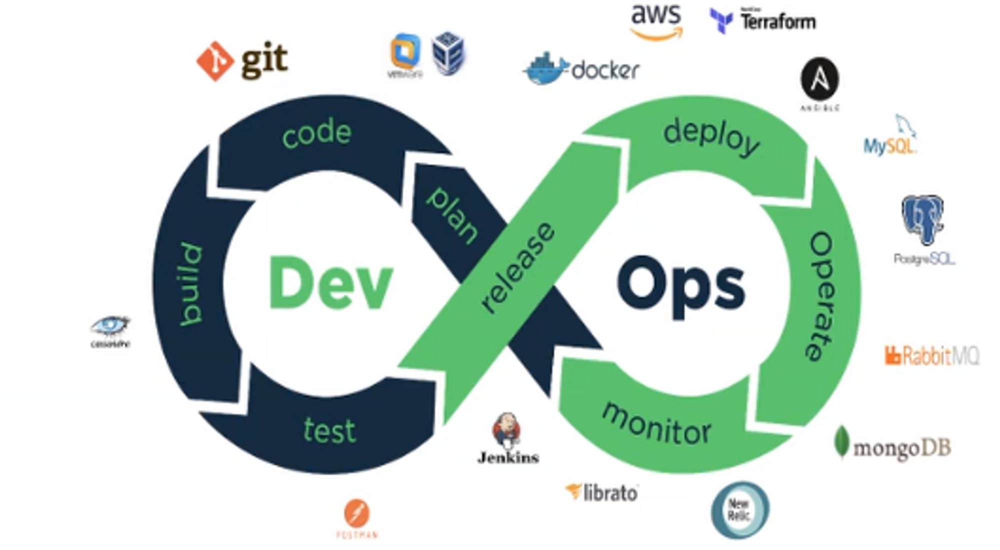
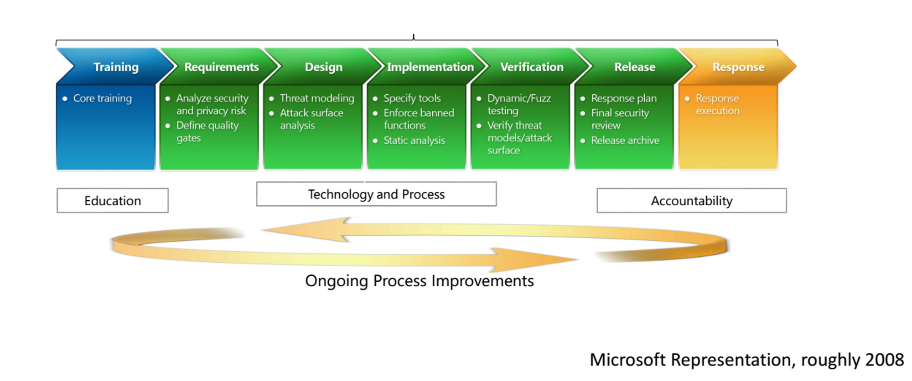

Desenvolvimento de Software não é uma matéria nova, e ao longo dos anos evoluiu em todos os seus aspectos, metodologias e formas de gerenciamento, cada um deles atendendo às necessidades de sua época ou da razão pela qual foi criado. 

Atualmente Agile é a metodologia mais difundida e utilizada pelas empresas, pela necessidade de acompanhar as mudanças e a velocidade com que elas acontecem, sendo assim tivemos que adequar a maneira como entregamos os softwares e sistemas criados para e por empresas que deles se utilizam, para entregar seus serviços, produtos e valor ao cliente. 

A tecnologia não só mudou a maneira como os softwares são criados como também a maneira como os negócios acontecem, sendo assim a maioria deles migraram seus processos e produtos para meios tecnológicos, tornando-se essencial que os softwares de fornecedores ou proprietários abordem as ameaças à segurança desde a sua concepção. 

Para a abordagem dos aspectos de segurança, temos modelos de SDLCs, waterfall, spiral, agile, DevOps, que auxiliam nessa função e que possibilitam a inserção de processos e ferramentas voltados para segurança, em cada fase do desenvolvimento de software. 

Implementar uma Esteira de Desenvolvimento Seguro (SSDLC) não é uma tarefa trivial, principalmente em ambientes que já possuem sistemas legados e precisam se adaptar às novas necessidade e princípios, tais como security by design e security by default, elementos que fornecem as maiores vantagens de segurança, buscando mitigar a introdução de vulnerabilidades e diminuir a exposição da superfície de ataque, respectivamente. 

Para entender um pouco mais como funciona uma Esteira de Desenvolvimento Seguro, abordaremos 3 fases do desenvolvimento, sendo elas: Educação/Conscientização, Tecnologias/Processos e Melhoria Contínua; dentro dessas fases abordaremos as 7 etapas existentes dentro da esteira, sendo: treinamento de código seguro, levantamento de requisitos, modelagem (design), implementação, verificação, lançamento (release) e melhoria contínua. 

Ao término dessas etapas, tentaremos elucidar os ganhos e dificuldades de se implementar uma SSDLC e como podemos evoluir o assunto dentro das empresas, fortalecendo seus sistemas e mitigando os riscos. Quanto mais empresas abordarem este assunto e entenderem sua importância no cenário atual, não somente seu ambiente se torna menos vulnerável e mais seguro, como também contribui para uma comunidade cada vez mais ciente dos riscos existentes, de como podem abordá-los e mitigá-los, inclusive transformando cada vez mais profissionais em agentes conscientes de suas responsabilidades, pois a segurança só pode ser alcançada quando todos entendem que fazem parte e tem um papel fundamental neste ecossistema.

